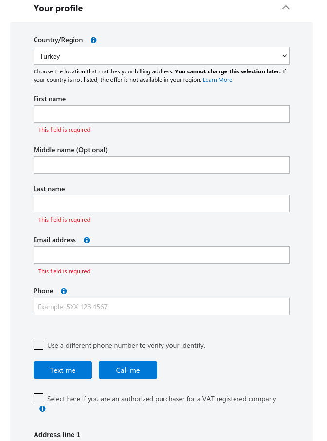

# 1. Creating Azure Account
Before you start you need Microsoft account.
If you do not have a microsoft account, you can sign up [here](https://account.microsoft.com/account/)

After creating an Microsoft account you can sign in for  [portal.azure.com](https://portal.azure.com/)

Azure Dashboard should like this:


For free Azure trial account click **Start** button.

Sign up form should like this:




After filling the form you need verify account with Credit or debit card. For credit card I've created <i>virtual credit</i> card and didn't have any issue for that. So I suggest to you same.

**Free Azure trial account**  offers: **$200** credit to use in your first **30 days**. Popular services free for 12 months. 

[These](https://portal.azure.com/#blade/Microsoft_Azure_Billing/FreeServicesBlade) are free service you can check out for limits.


# 2. Azure-Cli
Azure-cli azure command line based service manager tool.


## 2.1 Azure Cli for Debian Based Distribution
Azure-cli already in [Debian](https://packages.debian.org/bullseye/azure-cli) and [Ubuntu](https://packages.ubuntu.com/source/focal/azure-cli) repository.

For installing 
```
sudo apt-get install azure-cli
```

or if you want latest version of azure-cli you can add microsoft repository with this bash [script](https://docs.microsoft.com/en-us/cli/azure/install-azure-cli-linux?pivots=apt#option-1-install-with-one-command).

```bash
curl -sL https://aka.ms/InstallAzureCLIDeb | sudo bash
```

```bash
sudo apt update
sudo apt install azure-cli
```

## 2.2 Azure Cli For RPM Based Disribution

Import Microsoft repository key:

```
sudo rpm --import https://packages.microsoft.com/keys/microsoft.asc
```

Create local azure-cli repository information:

```
echo -e "[azure-cli]
name=Azure CLI
baseurl=https://packages.microsoft.com/yumrepos/azure-cli
enabled=1
gpgcheck=1
gpgkey=https://packages.microsoft.com/keys/microsoft.asc" | sudo tee /etc/yum.repos.d/azure-cli.repo
```

And install azure-cli with this commad.

```
sudo dnf install azure-cli
```


## 2.3 Azure Cli for Windows 10 or Windows 11

You can download [this](https://aka.ms/installazurecliwindows) MSI downloader. Once you downloaded you can use azure-cli with Powershell or Windows Command Prompt.

You can also use Windows Terminal which is azure-cli built in. You can download [here](https://www.microsoft.com/en-us/p/windows-terminal/9n0dx20hk701)

## 3. Log in Azure-cli

if you have successfully installed the azure-cli tool:

```bash
az login
```


Azure-cli will ask you to log-in your microsoft account in your default browser.


## 4. Azure-cli Commands

### 4.1 Resource Group

Resource group is a container that holds related resources for an Azure service. Like docker container registry, web applications and many azure services.

```bash
az account list-locations | grep -i name
```
This bash command lists all locations. You can choose which locations nearest you.


The ```name``` line should be locations input variable.

For example **East US 2**  input name should be ```centralus```


If you're using azure-cli on Windows Terminal this powershell command lists all locations.
```
az account list-locations | Select-String "name"
```
Output should be similar like above.Output should be similar like above.


### 4.1.1 Creating Resource Group

```
az group create --name zoomcamp --location westeurope
```


### 4.2.1 Creating Container registries

Azure Container Registry allows you to build, store, and manage docker container images in a private registry for all types of container deployments. 


```bash
az acr create --resource-group zoomcamp --name zoomcampacr --sku Basic
```
After ```--name ``` tag you **should choose unique** for docker container registry **name.** We're going to use login information for docker container repository when we push local docker container to azure docker container repository.

